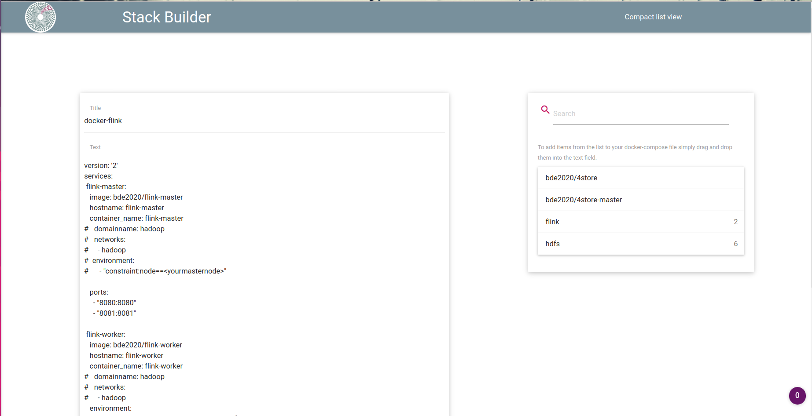

# Getting docker-compose path from cursor position

# Introduction

The [Stack Builder](https://github.com/big-data-europe/app-stack-builder) application as part of the [Big Data Europe](https://www.big-data-europe.eu/) is a system that helps in the process of building **docker-compose.yml** files. You can drag & drop existing docker-compose files from the project into a *textarea* to be shown and also search for other repositories in the big data europe github organization, composing a whole new system by taking useful pieces of systems and putting them together.


  


Additionally, it provides small hinting functionality for example by showing a dropdown menu with already existing containers to link them. The idea is to add more intelligence to this hinting process, by being able to know the context on where the user is situated while editing the docker-compose file, and therefore knowing what kind of information may be suitable for them.

```yml
  web:
    image: nginx
    volumes:
      - ./nginx.conf:/etc/nginx/nginx.conf:ro
    command: [nginx-debug, '-g', 'daemon off;']
```    

Say that the user has the cursor in the `- ./nginx.conf:/etc/nginx/nginx.conf:ro` line. If we know that the user is situated in the `web.volumes` path we can add hints into additional volume mount paths that are commonly used for **nginx** containers.

The problem is, how do we know where in the docker-compose.yml file is the cursor placed?

# Implementation

To see all the code just [check the repository](https://github.com/big-data-europe/ember-stack-builder-frontend), I will simplify those pieces that are not needed. The initial scenario is simple: the docker-compose file is loaded into a textarea and parsed into a yaml object:

```html
<div>
  <div class="input-field">
    {{textarea id="textarea-autocomplete" value=value label=label}}
    <label id="textarea-label-{{label}}" >{{label}}</label>
  </div>
</div>
```

```js
yamlObject: Ember.computed('value', function() {
  try {
    const yaml = this.yamlParser(this.get('value'));
    this.setProperties({
      yamlErrorMessage: '',
      yamlError: false
    });
    return yaml;
  }
  catch (err) {
    this.setProperties({
      yamlErrorMessage: err,
      yamlError: true
    });
    return null;
  }
})
```

This will return a javascript object with the parsed YAML. Now, every time the cursor moves in the **textarea** either by pressing arrow keys or writing into the textarea we want to know the path in the yaml object where it is placed, for example giving a point-separated path, (i.e: if the cursor is placed in the first link of the *identifier* service: `services.identifier.links.0`).

The first thing we need is to have a way of getting the line where the cursor is placed (for example, `- identifier:identifier` inside a `links` object). Since the whole docker-compose.yml is stored as a string inside the textarea, a way of doing it is getting the "context string" starting from the cursor's position and adding characters both left and right until you find "stop characters", which involving those that represent a line break or a tabulation in the YAML file.

```javascript
getCursorYmlPath() {
  const text = this.get('value');
  const cursorPosition = Ember.$('#textarea-autocomplete').prop("selectionStart");
  const stringLeft = this.stringPad('left');
  const stringRight = this.stringPad('right');
  const contextString = `${stringLeft(text, cursorPosition).text.trim()}${stringRight(text, cursorPosition).text.trim()}`;
}
```

Function **stringPad** returns the padding characters of a string starting from the cursor index until it finds a stop character.

```javascript
stringPad(direction) {
  return function (text, cursor) {
    let stopChars = ['\n', '\t'];
    let i = cursor;
    while (stopChars.indexOf(text[i]) === -1 && i > 0 && i < text.length) {
      if (direction === 'right') {
        i = i + 1;
      }
      else if (direction === 'left') {
        i = i - 1;
      }
      else {
        break;
      }
    }
    if (direction === 'right') {
      return {
        text: text.slice(cursor, i),
        index: i
      };
    }
    else if (direction === 'left') {
      return {
        text: text.slice(i, cursor),
        index: i
      };
    }
    else {
      return { text: "", index: -1 };
    }
  };
}
```

At the end, printing the contextString you get the whole line: `"- dispatcher:dispatcher"`.

The next step is to know where in the docker-compose.yml you can find the contextString. Since you can find the previous mentioned line in several services inside a docker-compose, I create a list of object paths that have the context string as a match:

```javascript
Array.prototype.flatten = function() {
  let arr = this;
  while (arr.find(el => Array.isArray(el))) { arr = Array.prototype.concat(...arr); }
  return arr;
};

getCursorYmlPath() {
  (...prev...)
  const pathMatches = this.getYmlPathMatches(contextString, this.get('yamlObject')).flatten();
}


getYmlPathMatches(contextString, yaml, currentPath) {
  if (yaml && yaml !== null) {
    var currentPath = currentPath || "root";

    return Object.keys(yaml).map((key) => {
      if (typeof yaml[key] === "object" && yaml[key] !== null) {
        if (contextString.includes(key)) {
          return [`${currentPath}.${key}`].concat(this.getYmlPathMatches(contextString, yaml[key], `${currentPath}.${key}`));
        }          
        else {
          return this.getYmlPathMatches(contextString, yaml[key], `${currentPath}.${key}`);
        }
      }
      else {
        if (contextString.includes(key) || contextString.includes(yaml[key])) {
          return `${currentPath}.${key}`;
        }
        else return [];
      }
    });
  }
  else return [];
}
```

Using **root** as the root object path, the result is a list of object paths like this:

```sh
["root.services.identifier.links.0", "root.services.dispatcher"]
```


Lastly, I retrieve the index in the **pathMatches** array that correspond to the closest match to the cursor's position.

```javascript
getCursorYmlPath() {
  (...prev...)
  const tramo = text.length / pathMatches.length;
  const probableIndex = Math.floor(cursorPosition / tramo);
  return pathMatches[probableIndex];
}
```   

There may be edge cases that I have not taken into account, but so far it is working nicely.

Have fun!
