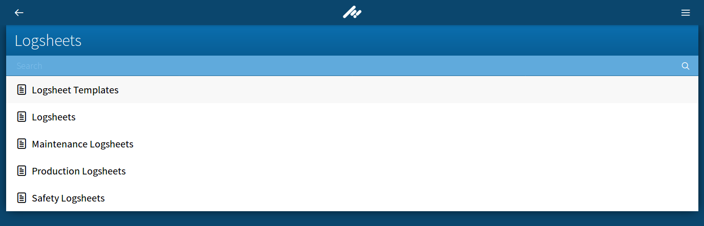
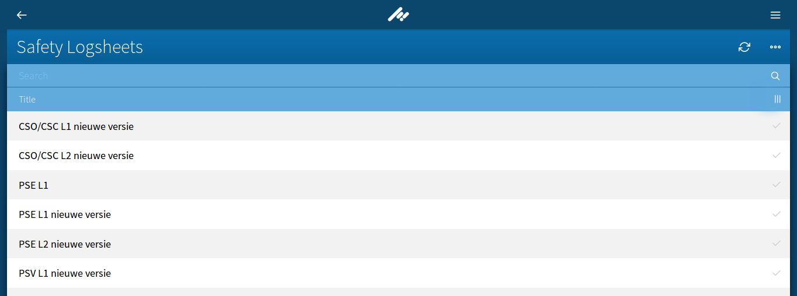
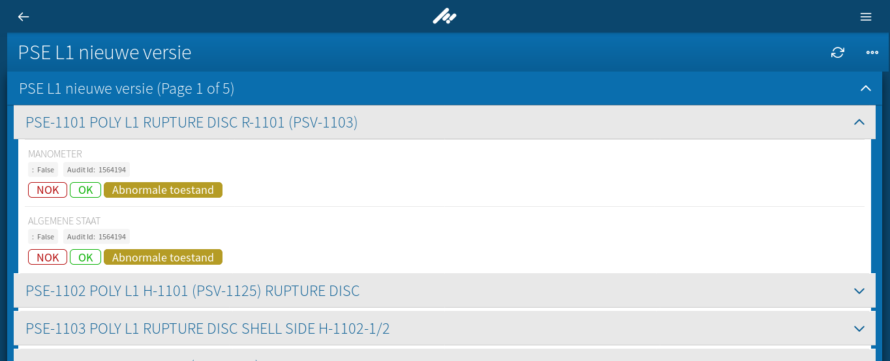

# Optimize rendering in an Ember 1.13 application

# Overview

When I started in **TenForce** 2 years ago I first did it as a developer to support the **Listly** web application, a frontend for the [management software suite](https://www.tenforce.com/industries/utilities-telecom/) written in Ember.js designed to function completely offline.

I worked on the application for one year, and then moved to the [Dacota One](http://www.dacota.one) team in the same company, transferring ownership to another developer.

What a surprise when around one month ago I was reached out by a project manager, stating that a client was having problems when rendering the json payload coming from the server in an old tablet, making the browser crash directly, and the current developer was not available.

When taking a look at the scenario some things became apparent:

* The crash and lagging only happens for this client and only for tablets.
* The received data was around 6.5 Mb, the only scenario with that file size, rest of the use cases and instances installed had smaller sizes.
* This should not be necessarily a problem, but the tablet used by the client is an old model with very low specs. Upgrading to a better one is not possible since the model has to pass a set of quality and security tests, as those tablets are meant to be used in an industrial environment.


The data model of **Listly** is easy to grasp. The object that governs all the logic is the *Item*. An item can be of type *Workspace*, *List*, or *List Item* depending on the level of abstraction you want to achieve. Workspaces have lists inside, and those have child items. Said items can at the same time have child items and so forth, according to the business case needs.

A hierarchical view of it can be seen like:

```yml
Workspace_1:
  List_1:
    Item_1:
      Item_1_1:
      Item_1_2:
    Item_2:
  List_2:
    Item_1:
    Item_2:
...
Workspace_n:
```


This is to make sense of the data in the UI, but the json payload has the same structure regardless of the type, and will be rendered accordingly.

It is easier to see it visually. This is the **Logsheets** workspace, composed by several lists:



Then, the **Safety Logsheets** list view:



An finally, the view of a single **Item** and it's hierarchical structure:



**Listly** replaces **Ember Data** by an custom solution ostensibly called the **listly-store**, designed to deal with some shortcomings ember-data had at the time. It also uses a modified version of the JSON-API protocol to fit its needs.

A simplified version of the data payload is as follows:


```json
{
  "data": [
    {
      "relationships": { ... },
      "properties": {
        "123_property1": {
          "value": "My value for property1"
        },
        "123_property2": {
          "value": "My value for property2"
        }
      },
      "tabs": [
        {
          "default": {
            "fields": [
              {
                "label": "My Label for property1",
                "name": "123_property1"
              }
              {
                "label": "Nested tab",
                "name": "My nested tab",
                "fields": [
                  ... this can be nested as wished ...
                ]
              }
            ]
          }
        },
        { "comments": { ... } },
        { "attachments": { ... } }
      ]
    }
  ]
}
```

As seen, there are two important objects:

* **properties** is a flat object containing every single property that the object may need, with their values and sometimes additional metainformation for visualization, as simple as that.
* **tabs** is an array containing the descriptions of how the data must be laid out and the hierarchy it follows. As seen in the payload object, each field contains a label to show and a "pointer" to the property in the properties object that will contain the correspondent value.

  Additionally, fields inside tabs can be children tabs themselves, yielding a tab structure as nested as needed by the use case.

  Fields no matter how deep they are in the structure, if they contain values they will point to somewhere in the **properties** object to retrieve them.


Whenever **listly** receives and update from the backend, it uses a costly custom deserializer, makes a diff-merge with the current item and performs updates in two different storage mechanisms (persistent, cache). The same happens when the UI is updated: per each button clicked and toggle button pressed, **listly** updates storage, uses a custom serializer and sends the update to the backend.  

The main problem was then that the *properties* and *tabs* objects contained so many fields & properties that in an old tablet it made the deserializer crash directly.

# Potential solutions

Several solutions were proposed to tackle this:

1. Migrate the whole application to Ember 2.18 and achieve the rendering performance improvement with *Glimmer 2* for free.
2. Move the **listly-store** to a *Service Worker* to perform all the serialize/desearialize and storage logic, releasing stress in the UI thread.
3. Paginate the items' child items to prevent the UI to render a huge list of items way beyond the viewport.
4. Whenever the user visits an item list, each one of the list items is fetched from the backend eagerly. This is not necessary since only a fraction of the information is shown in the list view, so a solution would be to fetch a partial version of the items for the list view, and when visiting the item then fully downloading it .
5. Every update to the user interface results in diffing, merging changes, serializing & sending it to the backend. This is extremely costly. Instead, it should be possible to create a small "update squashing service" for UI updates that would add a small debounce and create a single joint update to the item.
6. Substituting all standalone *label: value* readonly fields by a single one containing all the label & value pairs, stripping both the **properties** and **tabs** sizes and making the parsing way easier.  


# Conclusion

The first two solutions were initially discarded for them being quite long user stories compared to other potential approaches.

In the next series of posts I will describe each one of the strategies and how it improved performance in terms of rendering times and obviously, no longer making the browser crash.
