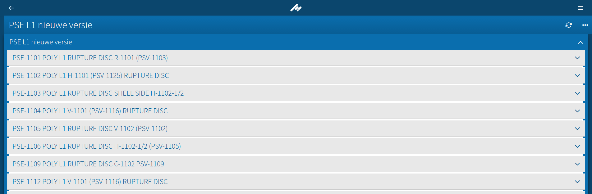
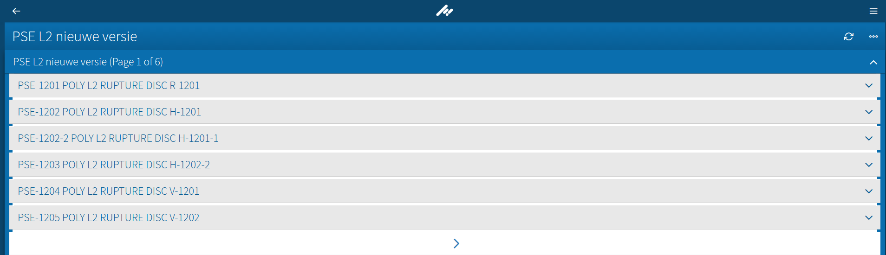

# Optimize rendering performance in an Ember 1.13 application (Part 1: Pagination)

# Introduction

This is the first actionable step to improve rendering performance, as mentioned in [the overview article](url to the overview). When the Item is visited, it is fully rendered, displaying a huge list of child items in the tabs shown way beyond the viewport. This is not usable as it completely wastes the UI thread.



(That list can grow and grow..)

# Solution

Once the data is fetched and deserialized, it is already in memory, but we can prevent stressing the UI thread by simply paginating the access to the information by paginating the tabs:




# Implementation

Each item is composed of tabs that can at the same time render fields or another tabs within. A visual example of this component structure is:

```yml
render-tab:
  render-default-tab:
    render-field:
    render-field:
render-tab:
  render-attachments-tab:
render-tab:
  render-default-tab:
    render-tab: # YOU CAN SEE THE NESTED TABS EXAMPLE HERE
      render-default-tab:
    render-field:
```

The **render-default-tab** component is the one in charge to show a regular generic tab:

**render-default-tab.hbs**:
```html
{{#properties-tab name=title open=open nested=nested}}
  {{#each rows as |row index|}}
    <div class="row">
      <div class="row-separator"></div>
      {{#each row as |field|}}
        {{#unless field.isUiSpacer}}
        <div class="property-separator"></div>
        {{/unless}}
        {{#if field.isNestedTab}}
          {{render-tab tab=field item=item nested=true}}
        {{else}}
          {{render-field field=field item=item waitCounter=index}}
        {{/if}}
      {{/each}}
    </div>
  {{/each}}
{{/properties-tab}}
```

To add pagination, it suffices to limit the number of visible rows and provide a mechanism to navigate through pages:

**render-default-tab.hbs**
```html
{{#properties-tab name=title open=open nested=nested}}
  {{#each visibleRows as |row index|}}
    <div class="row">
      <div class="row-separator"></div>
      {{#each row as |field|}}
        {{#unless field.isUiSpacer}}
        <div class="property-separator"></div>
        {{/unless}}
        {{#if field.isNestedTab}}
          {{render-tab tab=field item=item nested=true}}
        {{else}}
          {{render-field field=field item=item waitCounter=index}}
        {{/if}}
      {{/each}}
    </div>
  {{/each}}

  {{#if needPagination}}
    {{item-paginate tabsPerPage=tabsPerPage currentPage=currentPage totalPages=totalPages restPages=restPages switchPage='switchPage'}}
  {{/if}}
{{/properties-tab}}
```

Then, the next step is to determine whether an item needs pagination (currently, only items of type "Audit" are worth paginating as they are big enough):

```javascript
needPagination: Ember.computed('rows.length', 'tabsPerPage', 'item.hierarchy', function() {
  let hierarchy = this.get('item.hierarchy');
  let totalRows = this.get('rows.length');
  let tabsPerPage = this.get('tabsPerPage');
  return hierarchy.indexOf('Audit') !== -1 ? totalRows > tabsPerPage : false;
})
```

Afterwards, calculate the rows to show depending on the current page and the number of tabs to show per page.

```javascript
tabsPerPage: feature('TABS_PER_PAGE'), // This parameter is configurable per installation.
currentPage: 0,

totalPages: Ember.computed('rows.length', 'tabsPerPage', 'restPages', function() {
  let restPages = this.get('restPages');
  let partialResult = Math.floor(this.get('rows.length') / this.get('tabsPerPage'));
  return restPages > 0 ? partialResult + 1 : partialResult;
}),

restPages: Ember.computed('rows.length', 'tabsPerPage', function() {
  return this.get('rows.length') % this.get('tabsPerPage');
})


visibleRows: Ember.computed('rows.[]', 'tabsPerPage', 'currentPage', 'totalPages', 'restPages', 'needPagination', function() {
  let result;
  let needPagination = this.get('needPagination');
  let rows = this.get('rows');
  if (needPagination) {
    let tabsPerPage = this.get('tabsPerPage');
    let currentPage = this.get('currentPage');
    let totalPages = this.get('totalPages');
    let restPages = this.get('restPages');
    let offset = currentPage * tabsPerPage;
    if (currentPage === (totalPages - 1) && restPages > 0) { //Last page and there is rest.
      result = Ember.A(rows.slice(offset, offset + restPages));
    } else {
      result = Ember.A(rows.slice(offset, offset + tabsPerPage));
    }
  } else {
    result = rows;
  }
  return result;
})
```

The **item-paginate** component is quite simple, it will show/hide arrows when pagination is possible, and send the actions up to the wrapping component.

```javascript
var ItemPaginateComponent = Ember.Component.extend({
  classNames: "pagination-wrapper",
  previousPageAvailable: Ember.computed.gt('currentPage', 0),
  nextPageAvailable: Ember.computed('currentPage', 'totalPages', function() {
    return this.get('currentPage'); < (this.get('totalPages') - 1);
  }),
  previousPageClass: Ember.computed('previousPageAvailable', function() {
    return this.get('previousPageAvailable') ? 'exists' : 'does-not-exist';
  }),
  nextPageClass: Ember.computed('nextPageAvailable', function() {
    return this.get('nextPageAvailable') ? 'exists' : 'does-not-exist';
  }),
  actions: {
    nextPage: function() {
      if (this.get('nextPageAvailable')) {
        return this.sendAction('switchPage', this.get('currentPage') + 1);
      }
    },
    previousPage: function() {
      if (this.get('previousPageAvailable')) {
        return this.sendAction('switchPage', this.get('currentPage') - 1);
      }
    }
  }
});
```

And it's markup:

```html
<div class="pagination {{previousPageClass}} {{nextPageClass}}">
	<a {{action "previousPage"}} class="pagination-prev {{previousPageClass}}" title="Previous"><i class="icon icon--angle-left"></i></a>
	<a {{action "nextPage"}} class="pagination-next {{nextPageClass}}" title="Next"><i class="icon icon--angle-right"></i></a>
</div>
```


The final step is to add some visual clue to let the user know in which page they are. In the **render-default-tab** component we need to change the `name` property value from `title` to a computed one dependant on the page the user is in: `{{#properties-tab name=paginatedTitle open=open nested=nested}}
`.

```javascript
i18nService: Ember.inject.service('i18n'),
paginatedTitle: Ember.computed('i18nService.translate.pageOf', 'tab.shownTitle', 'needPagination', 'currentPage', 'totalPages', function() {
  let result;
  let pageOf = this.get('i18nService.translate.pageOf');
  let title = this.get('tab.shownTitle');
  let needPagination = this.get('needPagination');
  let currentPage = this.get('currentPage');
  let totalPages = this.get('totalPages');
  return needPagination ? `${title} (${pageOf.replace("{0}", currentPage + 1).replace("{1}", totalPages)})` : title;
})
```

The `i18nService.translate` will just fetch a template string from an available object and apply the transformations:

```javascript
var i18nDefaultLabels = {
  ...
  pageOf: "Page {0} of {1}"
  ...
}
```


The time to interactive comparison table is as follows, this is an average of 10 times:

|                 | No Pagination | Pagination |
|-----------------|---------------|------------|
| Big (~6Mb)      | ~20s          | ~10s       |
| Medium (~2.5Mb) | ~10s          | ~6s        |
| Small (~500Kb)  | ~5s           | ~2s        |


That's it, have fun!
