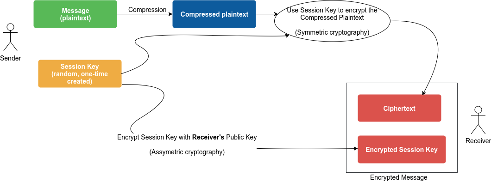
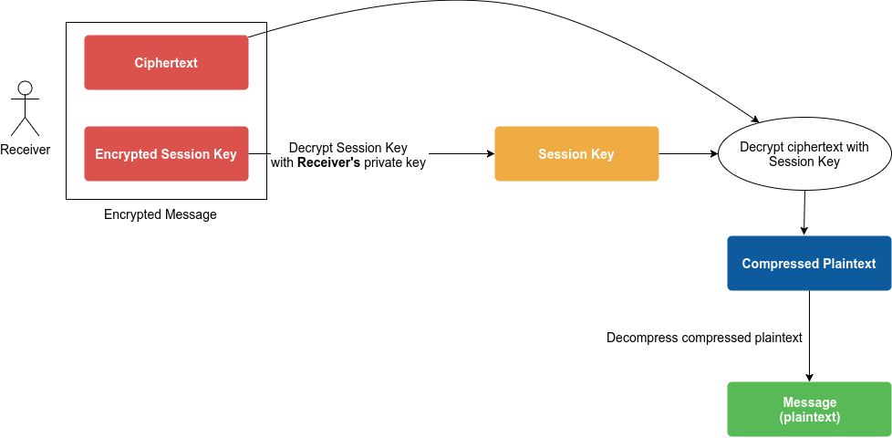
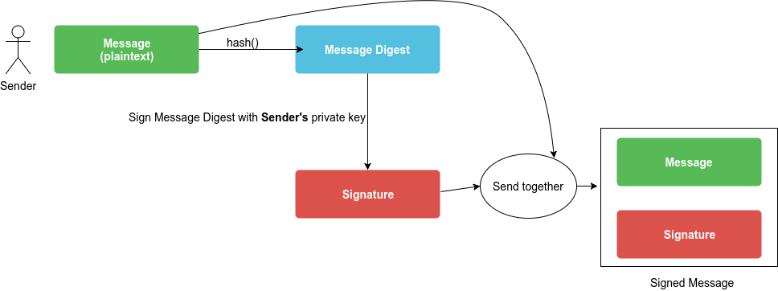

# Overview

I've had the intention of writing an article about **PGP** for a long time, but every time I started reading about the topic I almost immediately brushed the idea off. I believe this is spurred by the fact that understanding it is not quite simple. 

Just as monads, once you get the hang of it it becomes evident and you automatically lose the ability to communicate the concept to others.

Therefore, finally I decided to wrap my head around the matter and write a small article to try to simplify this concepts mostly for myself and hopefully for whomever reads it.

# What is **PGP**?

The simplest way I think of it is as an **information's encryption technology**. By information I mean as stated by [the wikipedia article](https://en.wikipedia.org/wiki/Pretty_Good_Privacy): *emails*, *files*, *text*, *directories* and *whole disk partitions*.

It provides a framework to exchange data securely among peers, as well as guaranteeing both the authenticity and integrity of the message.

# How does it work?

There are three main concepts I split **PGP** into:

1. Encryption/Decryption
2. Authenticity & Integrity
3. Web of Trust


## 1. Encryption/Decryption

Encrypting a message is the act of codifying it to make it unreadable to an external observer other than the intended recipient. The encoded message is called *ciphertext*. Decrypting is the inverse process where an unreadable message becomes accessible (converting from ciphertext back to plain text).

<br>


<br>


**PGP** uses several techniques to achieve that goal: *hashing*, *data compression* and *symmetric/asymmetric cryptography*. Explaining each one of them separately would go beyond the scope of the article. Moreover, they are no simple concepts to fathom, there is quite a bit of literature about them.

The process of data encryption & decryption has multiple steps to be taken into account. The best way to understand it is with a simple diagram where the flow of information being encrypted and sent from a *Sender* to a *Receiver* is depicted.

<br>



<br>


**Compression**: initially the message is compressed. This is done with a multiple purpose in mind: to reduce the amount of bytes to be transmitted, thus increasing performance, and additionally to enhance the cryptographic strength. Messages can have patterns that can be spotted in the text after encryption; compression helps on preventing those patterns to leak.

A new **Session Key** is generated per each one of the messages sent; this is a random string created by using multiple sources of entropy (randomness) in your computer, for example mouse movements. This key is then used to encrypt the compressed message data using symmetric cryptography, creating a compressed ciphertext. 

Afterwards, the **Session Key** alone is encrypted with the *Receiver's* public key (asymmetric cryptography) and attached to the compressed ciphertext, generating the whole encrypted message. The **Session Key** is later discarded. 

If the whole message is encrypted using the *Receiver's* public key (asymmetric), the size of the resulting message would spike, as well as dramatically increasing the computation time. As instead, by only encrypting the session key the process is faster and the final payload way smaller.

Inversely, what is left for the receiver is to use their private key to decrypt the session key, and use that session key to decrypt the entire message.

<br>



<br>

## 2. Authenticity & Integrity

**PGP** also provides capabilities to verify whether the received message has been sent by a specific sender. To give an example, how do you know that an email you received from *personitrust@trust.com* is actually from that person and not some impostor?

The solution **PGP** provides is by creating a *digital signature* of the message and sending it along so the receiver can verify it's origin. The process overview is like this:

<br>



<br>

Then, the *Receiver* will use the *Sender's* public key to verify the integrity of the message's hash that was signed with the *Sender's* private key. 

Because *there is a unique association between public and private key, if the sender uses a certain private key to sign a message and you verify the signature using the corresponding public, then the signature verification will succeed only if the message has not been altered*.

There might be however some cases where such statement does not hold ([See more](https://learncryptography.com/hash-functions/hash-collision-attack)).


## 3. Web of Trust

Public keys can be obtained in multiple manners: by downloading them from the site of the interested party, by email, using an untrusted key server, etc.. **PGP** stores all the public keys we need to communicate in a file called the *keyring*. 

You can sign several public keys, as so can others, establishing a network of *trust* among public key holders where for example you may accept a document signed by some external party whose public key has been signed enough times from several other sources you've deposited your confidence in.


# Example

## Sending an encrypted message using GPG

[GPG](https://gnupg.org/) is the free implementation for PGP, while the original one is protected. Lets think of the simple scenario where a *Sender* wants to send a **"Hello Amigo!"** message to a *Receiver*.

1. First, generate the key pair of the *Receiver*.

```sh
λ gpg --gen-key
```

This process will ask us for some information:

* **Kind of key**: 1 (RSA by default)
* **Keysize**: 4096
* **name**: Receiver
* **email**: receiver@receiver.com
* **password (to encrypt the private key symmetrically)**: receiver


2. Check the key pair was properly created.


For public key
```sh
λ gpg --list-keys
/home/esteban/.gnupg/pubring.gpg
--------------------------------
pub   4096R/D725A05G 2018-05-09
uid                  Receiver <receiver@receiver.com>
sub   4096R/D69D7E5G 2018-05-09
```

For private key
```sh
λ gpg --list-secret-keys
/home/esteban/.gnupg/secring.gpg
--------------------------------
sec   4096R/D725A05G 2018-05-09
uid                  Receiver <receiver@receiver.com>
ssb   4096R/D69D7E5G 2018-05-09
```

Then we encrypt the *Hello Amigo!* sentence using the *Receiver's* public key (*--armor* option tells GPG to generate a ascii-armored kind of message).
```sh
λ echo "Hello Amigo!" | gpg --encrypt --armor -r D725A05G > encrypted.msg
λ cat encrypted.msg
-----BEGIN PGP MESSAGE-----

hQIMA1BUvw3GnX5aAQ//Ypn2CtJRSQ/tAzgZfRzWly2afa+L5+a3B36WOlgNMDLU
wAlANapQeKTTzs1NuCEAQ3tNAGHSbP6q1iQzLf6jER3EuKufPAOFhaFITqbHie7f
JAMB+jQopYLXSHbMy39ZUVQWDBZQi4nMrobeSU4PqUqrKvV2CFCPW7TZYfToDxRT
38rlgrKq7v6+VIzOtpQVAuwI5rgGBNfd7HAQfpe+GeyWG8VWQ3Kw8tbG8pGf4c5G
a++puSz61NibAykPoanNdTOb880f6cBRijJY1Jqn6qhhvk1azSft8xm6dxoB4djD
dgOSdHcgQ01vsZxTpnUXBkIpDCllU1hFu/uNq524UVPdDBkYo3gjpp52Ghl6Lu/W
S1URzfaxhL6jD5fIHAYsRUxrPQDrkhIxClqWgLPCp65nvdNXHZ6BIQPIWqZ9TuSx
LjLcrS10TWMF6ulu1CdNQ2jpEQLVyywT6ie9/hWcFtlvUiL9wLqksRggCfxp2uB2
fLuWWkmCcY6rg1nJkLu4whd61FzgcyT6g8cNYCX/qR6Tp11uoMTekV2wrkDR8Biw
nX+WO68X2PlDlx97l5Z9HXL6YYDTROJsQN7ky7BIlVCGFRT4fJtqSZN+yAALV3MH
xV03qco2HKtyFzagsN0yiXvnlHI/GVB3kcco0NnUKJcJ0ujoNxRT4YV8LwddHm7S
SAFsUok7n41cdgUFwnXp7KH59infAWgJ6qTN46ZEcUR9Vfj74tmhQWVk2gBrF+qr
fuJ15S/38ZjBoXrEelyZ/B7yWo1UlcGnpw==
=JCqq
-----END PGP MESSAGE-----
```

Now we ideally we send this **encrypted.msg** gibberish text to the *Receiver* who is in posession of their private key, and they just need to type the key's password he established when they created it (**receiver**).

```sh
λ cat encrypted.msg | gpg

You need a passphrase to unlock the secret key for
user: "Receiver <receiver@receiver.com>"
4096-bit RSA key, ID D69D7E5G, created 2018-05-09 (main key ID D725A05G)

gpg: encrypted with 4096-bit RSA key, ID D69D7E5G, created 2018-05-09
      "Receiver <receiver@receiver.com>"
Hello Amigo!

```

That's it, Have fun!

# References

1. [https://users.ece.cmu.edu/~adrian/630-f04/PGP-intro.html](https://users.ece.cmu.edu/~adrian/630-f04/PGP-intro.html)
2. [https://en.wikipedia.org/wiki/Pretty_Good_Privacy](https://en.wikipedia.org/wiki/Pretty_Good_Privacy)
3. [https://en.wikipedia.org/wiki/GNU_Privacy_Guard](https://en.wikipedia.org/wiki/GNU_Privacy_Guard)
4. [https://security.stackexchange.com/questions/82490/when-signing-email-with-gpg-how-does-verification-by-the-receiver-work](https://security.stackexchange.com/questions/82490/when-signing-email-with-gpg-how-does-verification-by-the-receiver-work)
5. [http://zacharyvoase.com/2009/08/20/openpgp/](http://zacharyvoase.com/2009/08/20/openpgp/)
6. [https://www.cs.bham.ac.uk/~mdr/teaching/modules/security/lectures/PGP.html](https://www.cs.bham.ac.uk/~mdr/teaching/modules/security/lectures/PGP.html)
7. [https://www.openpgp.org/software/](https://www.openpgp.org/software/)
8. [https://gnupg.org/](https://gnupg.org/)
